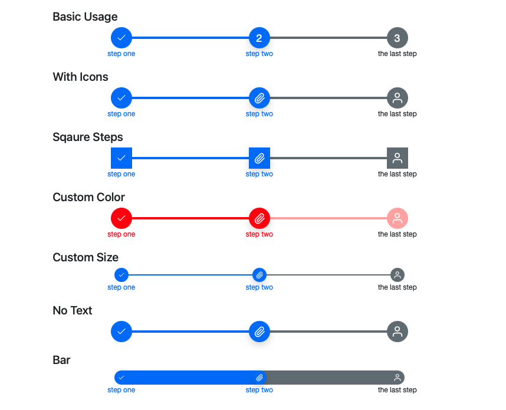

# Svelte steps component that is compatible to bootstrap

A customizable step component written in Svelte.



## Installation

```sh
npm install --saveDev svelte-steps
```

## Example Usages

Clone this project and run it. Itself is an example. Take a look at the homepage [here](https://svelte-steps.web.app)

### Basic Usage

```javascript
<script>
    import { Steps } from 'svelte-steps';
    let steps = [
        { text: 'step one' }, 
        { text: 'step two' }, 
        { text: 'the last step' }
    ];
</script>

<Steps {steps} />
```

### With Icons

```javascript
let steps = [
    { text: 'step one', icon: IconMoney },
    { text: 'step two', icon: IconPaperClip },
    { text: 'the last step', icon: IconPerson }
]
```

### Square Steps

```javascript
<Steps {steps} borderRadius="0"/>
```

### Custom Color

```javascript
<Steps {steps} primary="#ff0000" secondary="#ffaaaa"/>
```

### Custom Size

```javascript
<Steps {steps} size="2em" lineHeight="2px"/>
```

### No Text

```javascript
let steps = [
    { icon: IconMoney },
    { icon: IconPaperClip },
    { icon: IconPerson }
]
```

### Bar

```javascript
<Steps {steps} size="2rem" lineHeight="2rem"
```

### Events

```javascript
<Steps
    {steps}
    {current}
    on:click={(e) => {
        last = e.detail.last;
        current = e.detail.current;
    }}
/>
```

## Use with Bootstrap

It by default uses `--bs-primary`, `--bs-secondary`, `--bs-light`, and `--bs-dark` css variables if they are defined. These css vars are defined in bootstrap css:

```html
<!-- Include Bootstrap css in app.html <head></head> -->
<link
    href="https://cdn.jsdelivr.net/npm/bootstrap@5.0.2/dist/css/bootstrap.min.css"
    rel="stylesheet"
    integrity="sha384-EVSTQN3/azprG1Anm3QDgpJLIm9Nao0Yz1ztcQTwFspd3yD65VohhpuuCOmLASjC"
    crossorigin="anonymous"
/>
```

## Props

- `steps`:
  - Array of object. Length has to be more than 1
  - Required
  - Each item is a step object that can have:
    - `text`: The text displayed below each steps.
    - `icon`: A svelte component displayed inside each steps.
    - `iconProps`: An object that will be passed as props to the `icon` component.
- `current`: current step index. Number. Default `0`
- `size`: size of the step buttons. String. Default `"3rem"`
- `lineHeight`: height of the connecting lines between the step buttons. String. Default `"0.3rem"`
- `primary`: Primary color of passed and current steps. String. Default `'var(--bs-primary, #3a86ff)'`
- `secondary`: Secondary color of future steps. String. Default `'var(--bs-secondary, #bbbbc0)'`
- `light`: Primary color of text color in passed anc current steps. String. Default `'var(--bs-light, white)'`
- `dark`: Secondary color of text color in future steps. String. Default `'var(--bs-dark, black)'`
- `borderRadius`: Border radius of the step buttons. String. Default `'50%'` (circle)
- `fontFamily`: Font family of the component. String. Default `"'Helvetica Neue', Helvetica, Arial, sans-serif"`

## Events

- `on:click(e)`: click event with arg as the clicked step index as `e.detail.current` and last step index as `e.detail.last`
    

